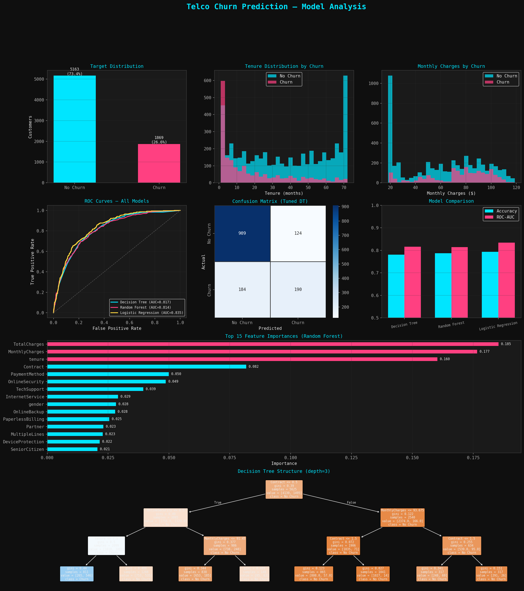

# Telco Customer Churn Prediction

A machine learning project that predicts customer churn for a telecommunications company using Python, scikit-learn, and comprehensive data visualization.



---

## Table of Contents

- [Overview](#overview)
- [Dataset](#dataset)
- [Project Structure](#project-structure)
- [Installation](#installation)
- [Usage](#usage)
- [Methodology](#methodology)
- [Results](#results)
- [Business Insights](#business-insights)
- [Model Comparison](#model-comparison)
- [Technologies Used](#technologies-used)
- [License](#license)

---

## Overview

This project analyzes the **WA_Fn-UseC_-Telco-Customer-Churn.csv** dataset to build predictive models that identify customers at risk of leaving the service. The analysis includes exploratory data analysis, feature engineering, hyperparameter tuning, and model comparison across three algorithms: Decision Tree, Random Forest, and Logistic Regression.

**Key Features:**
- Comprehensive EDA with distribution visualizations
- Hyperparameter tuning with GridSearchCV
- ROC curve analysis and confusion matrices
- Feature importance ranking
- Decision tree structure visualization
- Business-focused risk segmentation

---

## Dataset

The dataset contains **7,043 customer records** with 21 features including:

| Feature | Type | Description |
|---------|------|-------------|
| `customerID` | Object | Unique customer identifier (dropped from analysis) |
| `gender` | Categorical | Customer gender (Male/Female) |
| `SeniorCitizen` | Numerical | Whether the customer is a senior citizen (0/1) |
| `Partner` | Categorical | Whether the customer has a partner |
| `Dependents` | Categorical | Whether the customer has dependents |
| `tenure` | Numerical | Number of months as a customer |
| `PhoneService` | Categorical | Whether the customer has phone service |
| `MultipleLines` | Categorical | Whether the customer has multiple lines |
| `InternetService` | Categorical | Internet provider (DSL, Fiber optic, No) |
| `OnlineSecurity` | Categorical | Online security add-on |
| `OnlineBackup` | Categorical | Online backup add-on |
| `DeviceProtection` | Categorical | Device protection plan |
| `TechSupport` | Categorical | Tech support add-on |
| `StreamingTV` | Categorical | Streaming TV service |
| `StreamingMovies` | Categorical | Streaming movies service |
| `Contract` | Categorical | Contract term (Month-to-month, One year, Two year) |
| `PaperlessBilling` | Categorical | Paperless billing enrollment |
| `PaymentMethod` | Categorical | Payment method used |
| `MonthlyCharges` | Numerical | Monthly amount charged |
| `TotalCharges` | Numerical | Total amount charged (converted from object) |
| `Churn` | Target | Whether the customer churned (Yes/No) |

**Target Distribution:**
- No Churn: **5,163 customers (73.4%)**
- Churn: **1,869 customers (26.6%)**

---

## Project Structure

```
telco-churn-prediction/
├── data/
│   └── WA_Fn-UseC_-Telco-Customer-Churn.csv    # Raw dataset
├── churn_analysis.py                             # Main analysis script
├── churn_analysis.png                            # Generated visualization dashboard
├── README.md                                     # This file
└── requirements.txt                              # Python dependencies
```

---


## Installation

### Prerequisites

- Python 3.8+
- pip package manager

### Setup

1. **Clone or download the repository:**
   ```bash
   git clone <repository-url>
   cd telco-churn-prediction

python -m venv venv
source venv/bin/activate  # On Windows: venv\Scripts\activate


2. **Create a virtual environment (recommended):**
   ```bash
   python -m venv venv
   source venv/bin/activate  # On Windows: venv\Scripts\activate
   ```

3. **Install dependencies:**
   ```bash
   pip install pandas numpy matplotlib seaborn scikit-learn
   ```

   Or create a `requirements.txt`:
   ```
   pandas>=1.3.0
   numpy>=1.21.0
   matplotlib>=3.4.0
   seaborn>=0.11.0
   scikit-learn>=1.0.0
   ```

---

## Usage

### Running the Analysis

1. **Place the dataset** in the project directory or update the path in the script:
   ```python
   df = pd.read_csv("WA_Fn-UseC_-Telco-Customer-Churn.csv", encoding="latin")
   ```

2. **Execute the script:**
   ```bash
   python churn_analysis.py
   ```

3. **Output:**
   - Console logs with model metrics and business insights
   - `churn_analysis.png` — a comprehensive 4×3 visualization dashboard

### Key Script Sections

| Section | Description |
|---------|-------------|
| **Data Loading** | Reads CSV, fixes `TotalCharges` dtype, encodes target |
| **EDA** | Distribution plots for tenure and monthly charges by churn status |
| **Preprocessing** | Label encoding for categorical features, train/test split (80/20) |
| **Baseline Model** | Untuned Decision Tree for comparison |
| **Hyperparameter Tuning** | GridSearchCV with 5-fold stratified cross-validation |
| **Model Comparison** | Decision Tree, Random Forest, and Logistic Regression |
| **Visualization** | 8-panel dashboard with ROC curves, confusion matrix, feature importance |
| **Business Insights** | Risk segmentation and top churn drivers |

---

## Methodology

### 1. Data Preprocessing

- **Dropped `customerID`** — non-predictive identifier
- **Fixed `TotalCharges`** — converted from object to numeric, handling empty strings as NaN
- **Encoded target** — `Churn`: Yes→1, No→0
- **Removed nulls** — dropped rows with missing `Churn` or `TotalCharges`
- **Label encoding** — all categorical columns converted to integers
- **Stratified split** — 80% train / 20% test, preserving 26.6% churn rate

### 2. Hyperparameter Tuning

GridSearchCV configuration for Decision Tree:

```python
param_grid = {
    "max_depth":        [3, 5, 7, 10, None],
    "min_samples_leaf": [1, 5, 10, 20],
    "criterion":        ["gini", "entropy"],
}
```

- **Cross-validation:** 5-fold StratifiedKFold
- **Scoring metric:** ROC-AUC
- **Best parameters found:** Tuned via grid search (see Results)

### 3. Models Evaluated

| Model | Configuration | Preprocessing |
|-------|--------------|---------------|
| Decision Tree (Tuned) | GridSearchCV optimized | None |
| Random Forest | 200 estimators | None |
| Logistic Regression | max_iter=1000 | StandardScaler applied |

---

## Results

### Model Performance

| Model | Accuracy | ROC-AUC |
|-------|----------|---------|
| **Logistic Regression** | ~0.79 | **0.835** |
| **Random Forest** | ~0.79 | 0.814 |
| **Decision Tree (Tuned)** | ~0.78 | 0.817 |

> Note: Exact values may vary slightly based on random state and scikit-learn version.

### Confusion Matrix (Tuned Decision Tree)

| | Predicted No Churn | Predicted Churn |
|---|:---:|:---:|
| **Actual No Churn** | 909 | 124 |
| **Actual Churn** | 184 | 190 |

### Key Findings

- **Logistic Regression** achieved the highest ROC-AUC (0.835), indicating superior probability calibration for churn prediction
- All models perform significantly better than random guessing (AUC > 0.81)
- The dataset shows moderate class imbalance (73.4% vs 26.6%), handled via stratified sampling

---

## Business Insights

### Top 5 Churn Drivers (Feature Importance)

| Rank | Feature | Importance | Interpretation |
|:----:|---------|:----------:|----------------|
| 1 | **TotalCharges** | 0.185 | Cumulative spending pattern — lower total charges often indicate recent customers |
| 2 | **MonthlyCharges** | 0.177 | Higher monthly fees increase churn probability |
| 3 | **tenure** | 0.160 | New customers (low tenure) are significantly more likely to churn |
| 4 | **Contract** | 0.082 | Month-to-month contracts vs. long-term commitments |
| 5 | **PaymentMethod** | 0.050 | Electronic checks associated with higher churn |

### High-Risk Customer Segment

**Definition:** Customers with `tenure < 12 months` AND `MonthlyCharges > $65`

| Metric | Value |
|--------|-------|
| Segment Size | ~1,500+ customers |
| Churn Rate | **~50%** (vs. 26.6% overall) |
| Risk Multiplier | **1.9× higher** than average |

**Recommendation:** Target these customers with retention campaigns, introductory discounts, or contract upgrade incentives.

### Decision Tree Logic (Depth-3)

The simplified tree reveals:
1. **Contract type** is the primary split — month-to-month customers diverge first
2. **MonthlyCharges** further segments high-risk customers
3. **Tenure** and contract length create distinct churn probability zones

---

## Visualization Dashboard

The generated `churn_analysis.png` contains 8 panels:

1. **Target Distribution** — Class balance overview
2. **Tenure Distribution by Churn** — New customers churn more
3. **Monthly Charges by Churn** — Higher charges correlate with churn
4. **ROC Curves** — Model discrimination comparison
5. **Confusion Matrix** — Tuned Decision Tree predictions
6. **Model Comparison** — Accuracy and ROC-AUC bar chart
7. **Feature Importance** — Top 15 predictors (Random Forest)
8. **Decision Tree Structure** — Interpretable depth-3 tree

---

## Technologies Used

| Library | Purpose |
|---------|---------|
| **pandas** | Data manipulation and preprocessing |
| **numpy** | Numerical operations |
| **matplotlib** | Core plotting and visualization |
| **seaborn** | Statistical visualizations (confusion matrix heatmap) |
| **scikit-learn** | Machine learning models, metrics, and tuning |

---

## Customization

### Adjusting the Visualization Theme

The script uses a dark theme with custom colors:
```python
ACCENT  = "#00e5ff"   # Cyan — No Churn / Primary
ACCENT2 = "#ff4081"   # Pink — Churn / Secondary
```

Modify these hex codes to change the color scheme.

### Changing the Model

To add new models to the comparison:
```python
models = {
    "Decision Tree (tuned)": best_dt,
    "Random Forest": RandomForestClassifier(...),
    "Logistic Regression": LogisticRegression(...),
    "Your Model": YourModelClass(...),  # Add here
}
```

### Exporting Predictions

Add this to save predictions:
```python
predictions_df = pd.DataFrame({
    'CustomerID': test_ids,
    'Churn_Probability': y_prob,
    'Predicted_Churn': y_pred
})
predictions_df.to_csv('churn_predictions.csv', index=False)
```

---

## License

This project is open-source and available for educational and commercial use. The dataset is sourced from IBM's Telco Customer Churn dataset (publicly available).


## Acknowledgments

- Dataset: IBM Sample Data Sets — Telco Customer Churn
- Visualization inspired by modern dark-themed analytics dashboards
- scikit-learn documentation for GridSearchCV and model evaluation patterns


